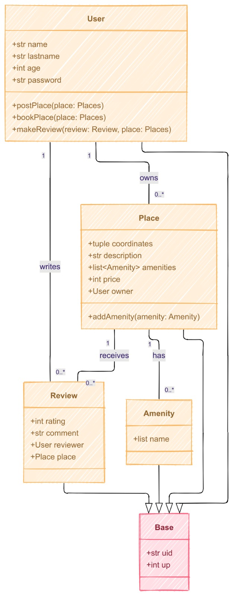
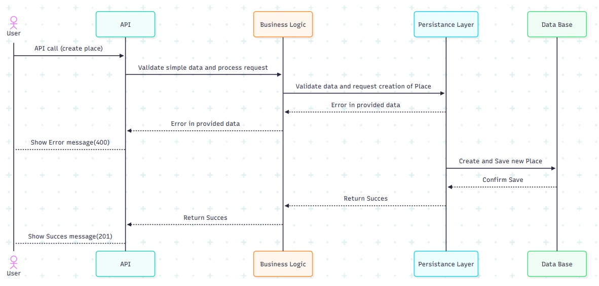

# Documentación Técnica del Proyecto HBnB
## Clon de AirBnB: Una Plataforma para la Gestión de Alojamientos

Este documento sirve como el **plan detallado y la referencia técnica** para el desarrollo del proyecto **HBnB** (un clon simplificado de AirBnB). Su objetivo es consolidar los diagramas de arquitectura, el diseño de la lógica de negocio y los flujos de interacción de la API para guiar la implementación y asegurar que todos los desarrolladores tengan una comprensión clara y unificada del sistema.

---

## 1. Arquitectura de Alto Nivel

Esta sección presenta la vista general de la aplicación, mostrando cómo se organizan los principales componentes.

### Diagrama de Paquetes de Alto Nivel

### Explicación de la Arquitectura
El proyecto HBnB sigue una **Arquitectura de Capas (Layered Architecture)** para separar responsabilidades, lo que hace que el código sea más manejable y escalable.

* **Capa de Presentación/Front-end (Web App / CLI):** Esta capa se encarga de la interfaz de usuario. Su única tarea es interactuar con el usuario y enviar peticiones a la capa inferior.
* **Capa de Fachada (Facade):** Implementamos un **Patrón Fachada**, que es el **único punto de acceso** a la lógica de negocio, simplificando la interfaz.
* **Capa de Lógica de Negocio (Business Logic Layer):** Aquí reside el **corazón de la aplicación**. Contiene las clases de las entidades y las reglas que definen el comportamiento del sistema.
* **Capa de Persistencia (Data Persistence Layer):** Se encarga de almacenar y recuperar los datos, siendo **independiente** del resto del sistema para permitir futuros cambios de base de datos.

---

## 2. Capa de Lógica de Negocio

Esta capa define las entidades de nuestro sistema y sus relaciones.

### Diagrama de Clases Detallado

### Explicación del Modelo de Datos
El diagrama de clases muestra las principales entidades (**Modelos**) que definen el proyecto y sus relaciones, todas heredando de una clase **`Base`** (`BaseModel`) que proporciona atributos comunes (`uid`, `up`).

* **`User`:** Representa al anfitrión o cliente. Puede **poseer (`owns`)** cero o muchos `Place` y **escribir** muchas `Review`.
* **`Place`:** El alojamiento. Es poseído por un `User`, **recibe** muchas `Review` y **tiene** muchas `Amenity`.
* **`Review`:** Una reseña de un usuario sobre un `Place`.
* **`Amenity`:** Representa servicios ofrecidos en el `Place`.

---

## 3. Flujo de Interacción de la API

Esta sección ilustra cómo fluyen las peticiones de datos entre los diferentes componentes del sistema al interactuar con la API.

### Diagramas de Secuencia para Llamadas API

* **Creación de un Objeto (`Place`):** 
* **Consulta de Objetos (`List of Places`):** 

### Flujo de Datos Típico (Ej. Crear un nuevo `Place`)
El diagrama de secuencia detalla el flujo de una petición API para crear una nueva instancia (`Place`).

* **Client (Navegador/App):** Inicia la petición HTTP (ej. `POST /places`) con los datos del nuevo lugar.
* **API Layer (Controlador/Ruta):** Recibe la petición, valida el formato básico y extrae los datos.
* **Facade Layer (Fachada):** Llama al método apropiado de la lógica de negocio.
* **Business Logic Layer (Modelo Place):** Valida las reglas de negocio y, si es válido, pide a la **Persistence Layer** que guarde el objeto.
* **Persistence Layer:** Se comunica con el almacenamiento para guardar los datos.
* **Retorno:** La API construye la respuesta HTTP (ej. **código 201 Creado**) y la envía de vuelta al Client.
